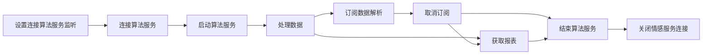

# 说明

将硬件端采集到的脑电和心率原始数据传入情感离线算法SDK，可以计算出实时分析值和最终报表值。

# 注意事项

#### 代码混淆

    -keep class cn.entertech.affectivesdk.authentication.bean.** { *; }

#### so 文件说明

算法核心功能实现依赖 so 库。在使用 SDK ，以及向工程中添加 so 时请注意以下几点：

##### 确保添加了正确的 so 库文件

###### **何为正确的 so 文件？**

官方发布新版 SDK 时一定会同时更新 jar 文件和 so 文件，您需要做的是更新这些文件到您的工程中，不要出现遗漏。您可以参考Eclipse、Android Studio 配置工程提到的添加方法进行操作。

##### 确保添加的 so 库文件与平台匹配

###### **何为正确的 so 文件与平台匹配？**

arm与x86，这代表核心处理器（cpu）的两种架构，对不同的架构需要引用不同的 so 文件，如果引用出现错误是不能正常使用 SDK 的。

解决这个问题最简单的办法是在 libs 或 jnilibs 文件夹下只保留 arm64-v8a 一个文件夹。

# 集成

### Gradle自动集成

在module的build.gradle文件下添加以下依赖

```groovy
implementation 'cn.entertech.android:affective-offline-sdk-shuhe:1.1.3'
```

在项目根目录的build.gradle文件下添加以下依赖地址

```groovy
allprojects {
    repositories {
        mavenCentral()
    }
}
```

app/src/main/jniLibs目录下对应平台的so文件拷入自己的工程中

### 本地依赖

将Demo中app/libs目录下的affective-offline-sdk-shuhe-1.1.2.aar文件和app/src/main/jniLibs目录下对应平台的so文件拷入自己的工程中

# 使用

## 初始化

```kotlin
 private val affectiveDataAnalysisService by lazy {
        IAffectiveDataAnalysisService.getService(AffectiveServiceWay.AffectiveLocalService)
}
```

## 连接算法服务

```kotlin
fun connectAffectiveServiceConnection(
        listener: IConnectionServiceListener,
        configProxy: EnterAffectiveConfigProxy
)

interface IConnectionServiceListener {
    /**
     * 连接成功
     * @param sessionId sessionId
     * */
    fun connectionSuccess(sessionId:String?)

    /**
     * 连接失败
     * */
    fun connectionError(error: Error?)
}
```

**参数说明**

|      参数     |             类型             |           说明           |
| :---------: | :------------------------: | :--------------------: |
|   listener  | IConnectionServiceListener | 连接结果回调，连接成功返回sessionId |
| configProxy |  EnterAffectiveConfigProxy |   配置信息，使用**默认构造函数**即可  |

## 启动算法服务

```kotlin
 fun startAffectiveService(
        initListener: IStartAffectiveServiceLister
)

interface IStartAffectiveServiceLister {
    /**
     * 启动成功
     * */
    fun startSuccess()

    /**
     * 启动生物基础服务失败
     * */
    fun startBioFail(error: Error?)

    /**
     * 启动生理基础服务失败
     * */
    fun startAffectionFail(error: Error?)

    /**
     * 启动失败
     * */
    fun startFail(error: Error?)
}
```

**参数说明**

|      参数      |              类型              |     说明     |
| :----------: | :--------------------------: | :--------: |
| initListener | IStartAffectiveServiceLister | 启动算法服务结果回调 |

## 实时数据的订阅

实时数据字段说明详见：[基础数据字段说明](https://github.com/Entertech/Enter-Affective-Offline-SDK/blob/main/%E5%AE%9E%E6%97%B6%E7%94%9F%E7%89%A9%E5%9F%BA%E7%A1%80%E6%95%B0%E6%8D%AE%E5%AD%97%E6%AE%B5%E8%AF%B4%E6%98%8E.md),[情感数据字段说明](https://github.com/Entertech/Enter-Affective-Offline-SDK/blob/main/%E5%AE%9E%E6%97%B6%E7%94%9F%E7%90%86%E7%8A%B6%E6%80%81%E5%9F%BA%E7%A1%80%E6%95%B0%E6%8D%AE%E5%AD%97%E6%AE%B5%E8%AF%B4%E6%98%8E.md)

```
IAffectiveDataAnalysisService.subscribeData(
        bdListener: ((RealtimeBioData?) -> Unit)? = null,
        listener: ((RealtimeAffectiveData?) -> Unit)? = null,
    )

/**
     * 取消订阅
     * */
    IAffectiveDataAnalysisService.unSubscribeData(
        bdListener: ((RealtimeBioData?) -> Unit)? = null,
        listener: ((RealtimeAffectiveData?) -> Unit)? = null,
    )

    private val bioListener: (RealtimeBioData?) -> Unit by lazy {
        {
            it?.realtimeSCEEGData?.apply {
                val msg = "实时脑电波: $sceegWave 脑电波节律：α波 $sceegAlphaPower " +
                        "β波:$sceegBetaPower Gamma波: $sceegGammaPower Delta波: $sceegDeltaPower " +
                        "Theta波: $sceegThetaPower 数据质量： $sceegQuality"
                log(msg)
            } ?: kotlin.run {
                val msg = "sceegDate is null"
                log(msg)
            }
        }
    }

    private val affectiveListener: (RealtimeAffectiveData?) -> Unit by lazy {
        {
            it?.realtimeSleepData?.apply {
                log(
                    "睡眠程度: $sleepDegree 入睡状态：${
                        if (sleepState == 0.0) {
                            "未睡着"
                        } else {
                            "入睡了"
                        }
                    }"
                )
            }
        }
    }


```

## 解析脑电波数据文件

```kotlin
 fun <R> readFileAnalysisData(inputStream: InputStream,
                                 appSingleData: ((R) -> Boolean)? = null,
                                 appendAllData: (List<R>) -> Unit,
                                 case: (String) -> R,
                                 callback: Callback,
 )

```

**参数说明**

|       参数      |         类型         |                        说明                       |
| :-----------: | :----------------: | :---------------------------------------------: |
|  inputStream  |     inputStream    |                     脑电数据文件流                     |
| appSingleData |  ((R) -> Boolean)? | 处理单个数据，true 表示消耗，则表示消耗该数据，不添加到appendAllData数据里面 |
| appendAllData | (List\<R>) -> Unit |        数据流读取出来的所有数据，除了appSingleData消耗了的数据       |
|      case     |    (String) -> R   |               数据流读取出来的字符串转成需要的类型R               |
|    callback   |      Callback      |                      解析结果回调                     |

脑波单通道数据文件流的解析分两种，一种是有包头包尾的完整数据文件流，一种是只有有效数据的有效数据文件流

### 解析完整的单通道数据文件流

    readFileAnalysisData(inputStream, { singleData ->
                        
                            SingleChannelEEGUtil.process(singleData) { allData ->
                                appendSCEEGData(allData)
                            }
                            true
                        }, { allData ->
                           //不做任何处理
                        }, {
                            it.toInt()
                        }, object : Callback {
                            override fun onError(error: Error?) {
                                appendLog("解析文件失败：${error}")
                            }

                            override fun onSuccess() {
                                appendLog("解析文件成功")
                            }
                        })

#### 解析完整的单通道数据

    SingleChannelEEGUtil.process(byteInt: Int, appendDataList: (List<Int>) -> Unit)

|       参数       |          类型          |                         说明                        |
| :------------: | :------------------: | :-----------------------------------------------: |
|     byteInt    |          Int         | Byte 转成0-255的int型，可通过CharUtil.converUnchart方法进行转换 |
| appendDataList | (List\<Int>) -> Unit |                  处理一个有效的单通道数据的方法                  |

### 解析有效的单通道数据文件流

    readFileAnalysisData(inputStream, { singleData ->
    						//也可以单独发送，这里就得返回true
                            false

                        }, { allData ->
                            if (allData.isNotEmpty()) {
                                appendSCEEGData(allData)
                            }
                        }, {
                            it.toInt()
                        }, object : Callback {
                            override fun onError(error: Error?) {
                                appendLog("解析文件失败：${error}")
                            }

                            override fun onSuccess() {
                                appendLog("解析文件成功")
                            }
                        })


## 处理数据

```
	/**
     * 发送数据
     * */

    fun appendEEGData(brainData: ByteArray)

    /**
     * 单通道数据
     * */
    fun appendSCEEGData(brainData: ByteArray)

    /**
     * 添加心率数据
     * */
    fun appendHeartRateData(heartRateData: Int)


    /**
     * 坐垫数据
     * */
    fun appendPEPRData(peprData: ByteArray)


```

## 获取报表

相应返回的 report 字段，具体字段的详细描述见[报表数据字段详情](https://github.com/Entertech/Enter-Affective-Offline-SDK/blob/main/%E6%8A%A5%E8%A1%A8%E6%95%B0%E6%8D%AE%E5%AD%97%E6%AE%B5%E8%AF%B4%E6%98%8E.md)。

```kotlin
fun getReport(listener: IGetReportListener, needFinishService: Boolean)

/**
 * 获取报表接口
 * */
interface IGetReportListener {

    /**
     * 获取报表出错
     * */
    fun onError(error: Error?)


    /**
     * 获取报表成功
     * */
    fun onSuccess(report: UploadReportEntity?)

    /**
     * 获取生物基础数据报表出错
     * */
    fun getBioReportError(error: Error?)


    /**
     * 获取生理状态分析数据报表出错
     * */
    fun getAffectiveReportError(error: Error?)
}

//获取报表实体类
data class UploadReportEntity(
        val code: Int,

        val `data`: Data? = null,
        val msg: String,
        .....//无用数据
        )

data class Data(
       val affective: Affective,
        val biodata: Biodata
)


data class Biodata(
        //单通道数据
        val sceegData:Sceeg,
       ...
)

data class Affective(
    ...
    val sleep: Sleep
)


data class Sceeg(
    val sceegAlphaCurve: List<Double>,
    val scegBetaCurve: List<Double>,
    val sceegDeltaCurve: List<Double>,
    val sceegGammaCurve: List<Double>,
    val sceegThetaCurve: List<Double>,
    val sceegQualityRec: List<Int>
)


data class Sleep(
    /**
     * 睡眠曲线，反映整个体验过程的睡眠情况。睡眠曲线的值越高表明越接近清醒，曲线值越低表明越接近深睡。
     * */
    val sleepCurve: ArrayList<Double> = ArrayList(),
    /**
     * 入睡点时间索引,即入睡时刻在睡眠曲线上的时间轴坐标。数值范围[0, +∞),0表示无效值
     * */
    val sleepPoint: Int = 0,
    /**
     * 入睡用时，单位：秒
     * */
    val sleepLatency: Int = 0,
    /**
     * 清醒时长，单位：秒
     * */
    val awakeDuration: Int = 0,
    /**
     * 浅睡时长，单位：秒
     * */
    val lightDuration: Int = 0,
    /**
     * 深睡时长，单位：秒
     * */
    val deepDuration: Int = 0,
    /**
     * 快速眼动时长
     */
    var remDuration: Int = 0,
    /**
     * 运动次数
     */
    var movementCount: Int = 0,
    /**
     * 惊醒次数
     */
    var arousalCount: Int = 0,
    /**
     * 容差
     */
    var disturbTolerance: Double = 0.0,

    val sleepEegAlphaCurve: List<Double> = ArrayList(),

    val sleepEegBetaCurve: List<Double> =
        ArrayList(),

    val sleepEegThetaCurve: List<Double> =
        ArrayList(),

    val sleepEegDeltaCurve: List<Double> =
        ArrayList(),

    val sleepEegGammaCurve: List<Double> =
        ArrayList(),

    val sleepEegQualityRec: List<Int> =
        ArrayList(),

    val sleepMovementRec: List<Int> =
        ArrayList(),

    val sleepArousalRec: List<Int> = ArrayList()
)


```

**参数说明**

|         参数        |         类型         |          说明          |
| :---------------: | :----------------: | :------------------: |
|      listener     | IGetReportListener |        获取报表回调        |
| needFinishService |       Boolean      | 是否需要自动结束算法 true 自动结束 |

## 资源释放

注意，每次使用完算法都需调用如下finishAffectiveService方法来释放算法资源

```kotlin
    fun finishAffectiveService(listener: IFinishAffectiveServiceListener)
```

## 断开算法服务

    fun closeAffectiveServiceConnection()

## 流程图



# 常见问题

#### 运行demo 报 dlopen failed: library "libaffective.so" not found

使用adb命令查询目标设备或模拟器的架构

    adb shell getprop ro.product.cpu.abi

在项目application类型的组件下的gradle 中的android/defaultConfig添加下面配置代码。abi指的是目标设备或模拟器的架构。

    ndk {
                abiFilters abi
        }

